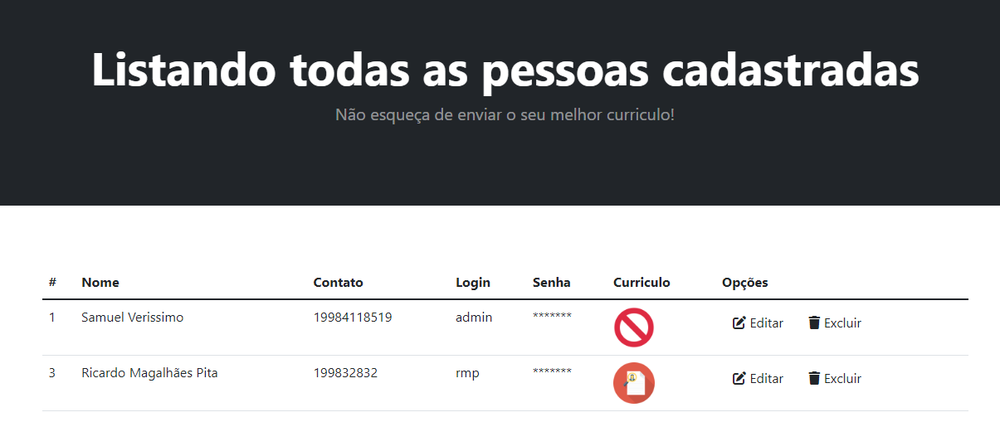

# Projeto de inscrições de trabalho
Desenvolvi esse sistema com a finalidade de criar um sistema de envio de currículos, referente a vagas de trabalho. 	
Foi referente há um projeto de minha faculdade, é um sistema, feito de uma maneira simples utilizando PHP PDO e MySQL.
No entanto, bem funcional, dinâmico e simples!

# Tela inicial

# Pessoas cadastradas

# Inscrições em vagas

# Vagas abertas 

### Funcionalidades 

- CRUD: usuários/vagas/áreas/departamentos (Create, read, update, delete)        
- Gerenciamento de usuários que se inscreveram
- Gerenciamento de vagas existentes
- Gerenciamento de login

### Linguagens utilizadas 

- PHP        (PDO)  
- Bootstrap4 (Framework) 
- MySQL      (Banco de dados)
